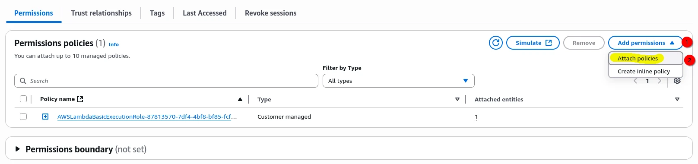
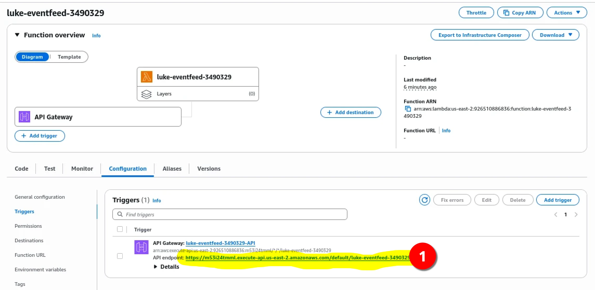

# AWS News Feed

This project I have given you a simple website front end to show students upcoming club events.
What you need to do is build the cloud infrastructure to make it work.
These instructions will not go in deep detail on each AWS product used because it should all be review.
You will need to use the `CloudDevOpsStudent` role to complete this assignment.

## S3

1. Make a S3 Bucket called `yourname-club-news-feed-randomnumbers`.
2. Replace your name and replace `randomnumbers` with some random numbers.
3. Make this S3 Bucket Public.
4. Upload three pictures from the internet. Any three photos will.
5. Update the bucket policy. Replace `Bucket-Name` with the name of your S3 Bucket.
6. Take a screenshot of your bucket with your images.

```yaml
{
  "Version": "2012-10-17",
  "Statement": [
    {
      "Sid": "PublicReadGetObject",
      "Effect": "Allow",
      "Principal": "*",
      "Action": [
        "s3:GetObject"
      ],
      "Resource": [
        "arn:aws:s3:::Bucket-Name/*"
      ]
    }
  ]
}
```

What your bucket should look like.


## DynamoDB

1. Create a DynamoDB table called `yourname-newsfeed-db-randomnumbers` (replace your name and the random numbers).
2. Set the PartitionKey to `eventKey`.
3. Wait for your table to be created.
4. Start added your data, use the [file in this repo as an example](./src/lib/eventDataEXAMPLE.json).
5. Only add one element at a time.
6. NOT THE WHOLE ARRAY.
7. Make sure to change the URL to match the one from your S3 bucket.
8. Repeat this for each event YOU SHOULD HAVE THREE IN TOTAL.
9. Take a screenshot of your DB showing off your data.


## Lambda

1. Create a Lambda Function named `yourname-eventfeed-randomNumber` of course changing the name and random numbers.
2. For RunTime choice Python 3.13.
3. Click "Create Function".
4. Now in your new function edit the permission so it can read your DynamoDB. We will be Using IAM for this.
    - Access the IAM Role.
      
    - Add a new policy to our Lambda Function.
      
    - Add the `AmazonDynamoDBReadOnlyAccess` policy. After it should look something like this
      
5. Add the code below to your Lambda function (Might need to fix formating). Make sure to change the value of
   `table_name` to your DynamoDB table name.
6. Click the Deploy button. Then run a test.
    - 

```python
import json
import boto3

def lambda_handler(event, context):
    dynamodb = boto3.client('dynamodb')
    table_name = 'your-table-name-here'  # **IMPORTANT: Replace with your actual DynamoDB table name**

    try:
        response = dynamodb.scan(
            TableName=table_name
        )
        items = response.get('Items', [])

        formatted_items = []
        for item in items:
            formatted_item = {}
            for key, value in item.items():
                if 'S' in value:
                    formatted_item[key] = value['S']
            formatted_items.append(formatted_item)

        return {
            'statusCode': 200,
            'headers': {
                'Content-Type': 'application/json',
                'Access-Control-Allow-Origin': '*',
                'Access-Control-Allow-Methods': 'GET, OPTIONS',
                'Access-Control-Allow-Headers': 'Content-Type, X-Amz-Date, Authorization, X-Api-Key, X-Amz-Security-Token'
            },
            'body': json.dumps(formatted_items)
        }
    except Exception as e:
        print(f"Error reading from DynamoDB: {e}")
        return {
            'statusCode': 500,
            'headers': {
                'Content-Type': 'application/json',
                'Access-Control-Allow-Origin': '*'
            },
            'body': json.dumps({'error': str(e)})
        }
```

## API Gateway

1. In the Lambda Function Dashboard click add a "Trigger".
2. Create a new REST API with open security.
   
3. Test out your new API using the API endpoint by clicking the link. 
   
4. You should see JSON in your browser.
   
5. Take a screenshot of your Lambda function including your API Gateway.

## Connecting Front End

To get a copy the front end website code on your own machine please clone down this repo.
Make sure you are in the write folder when using the terminal (i.e. user/documents/cloud/).
Open your terminal and clone down the repo with the following command. 

```bash
git clone https://github.com/sorrymint/AWSNewsFeed.git
```

## Run It

To get the frond end website running **LOCALLY** make sure you have [node.js](https://nodejs.org/en/download) installed.
Then run the following commands.
Then see the app running in your browser.
The project will not fully work until you finish your AWS infrastructure.
Take a screenshot of your working local website.

```bash
npm install
npm run dev
```

> ⚠️ You will need to insert **YOUR OWN** API URL in the [Home Page](src/routes/+page.svelte) around line 18.

This is what the website would look like but with a third event.


## What to turn In

Using a word processor combine the following documentation:

- Screenshot of S3 Bucket with your three images.
- Screenshot of DynamoDB with three items.
- Screenshot of Lambda Function Dashboard showing that you have the gateway.
- Screenshot of Front End website running locally displaying data.
- Must go back and delete all **your** cloud infrastructure to get full credit.
- Write a paragraph (3-5 full sentences) **OR** detailed digram explaining the dataflow from Cloud -> Web. Make sure to
  touch on all parts of your cloud infrastructure.
